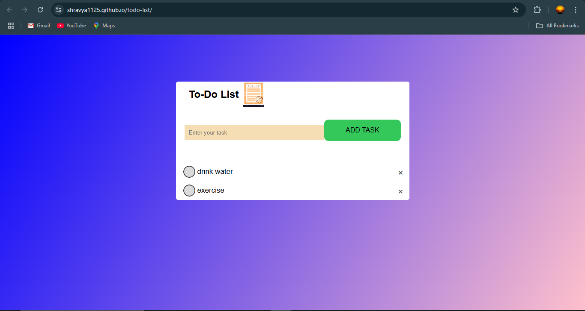

# 📝 To-Do List App

A simple To-Do List web app to manage your daily tasks efficiently.

## 🚀 Features
- 🖊️ Add, Edit, Delete Tasks
- 🎨 Responsive Design
- 💾 Stores Tasks in Local Storage

## 📸 Preview


## 🔧 Technologies Used
- HTML
- CSS
- JavaScript

## 📂 Setup
1. Clone the repo:
   ```bash
   git clone https://github.com/shravya1125/todo-list.git

2. Open index.html in a browser.

📌 Live Demo 
👉 [View it here](https://shravya1125.github.io/todo-list/)


🤝 Contributing
Pull requests are welcome! Feel free to improve the design or add new features.
